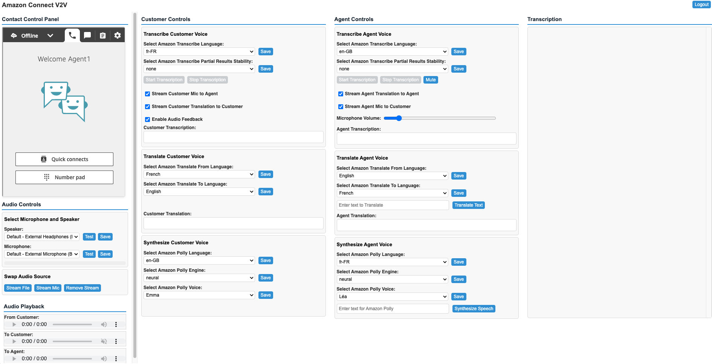
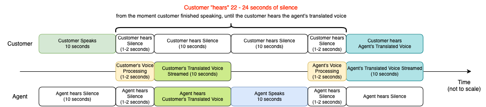
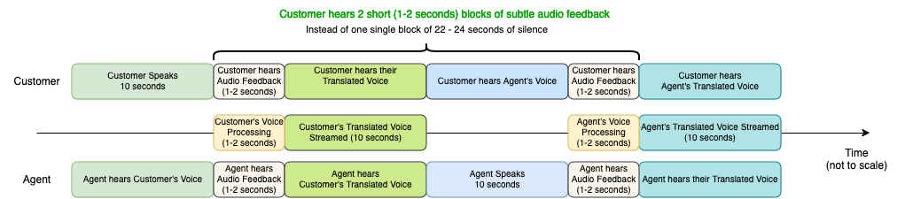

# Amazon Connect Voice to Voice (V2V) Translation Demo Guide

## Table of Contents

- [Demo UI Guide](#demo-ui-guide)
- [Audio Streaming Add-Ons](#audio-streaming-add-ons)
- [Amazon Transcribe Partial Results Stability](#amazon-transcribe-partial-results-stability)

## Demo UI Guide

# Amazon Connect Voice to Voice (V2V) Translation Demo Guide

**Important:** In the Audio Controls panel, select the microphone and speaker device that you use to engage with customer voice calls in Amazon Connect.

**Note:** For demo purposes, you can also test different streaming behaviors that influence the customer experience:

- **Stream File** - only streams a pre-recorded file to the customer (could be used if there was a technical issue, or to greet the customer while the agent gets ready)
- **Stream Mic** - only streams the actual agent microphone to the customer (the default behaviour)
- **Remove Audio Stream** - acts as a mute button, by removing the current audio stream (file / mic / translated voice)

**The user interface consists of four sections:**

1. The Amazon Connect CCP (framed softphone client)
2. The Customer to Agent interaction controls (Transcribe Customer Voice, Translate Customer Voice, Synthesize Customer Voice)
3. The Agent to Customer interaction controls (Transcribe Agent Voice, Translate Agent Voice, Synthesize Agent Voice)
4. The Transcription panel displays real-time transcribed and translated text during the call, to enable monitoring of transcription/translation accuracy, and identifying where Amazon Transcribe Custom vocabularies and/or Amazon Translate custom terminologies might improve accuracy (for the demo purposes, transcripts are ephemeral and reset with each new call).

Before placing an incoming call, configure the following:

- In the **Customer Controls** panel, under **Transcribe Customer Voice**:

  - Select the language being spoken by the customer (can be pre-configured for demo purposes)
  - Select Amazon Transcribe Partial Results Stability (see **Amazon Transcribe Partial Results Stability** section)
  - Click "Save" for each selection
  - Check "Stream Customer Mic to Agent" to allow agent to hear customer's original voice
  - Check "Stream Customer Translation to Customer" to allow customer to hear their translated speech
  - Check "Enable Audio Feedback" to enable streaming of pre-recorded "contact center background noise" (at a very low volume, and automatically muted when agent reply is being delivered to customer).
  - These options are recommended for a more natural conversation experience (see **Audio Streaming Add-Ons** section)

- In the **Customer Controls** panel, under **Translate Customer Voice**:

  - Select Amazon Translate **From** Language: the customer's native language
  - Select Amazon Translate **To** Language: the agent's native language
  - Click "Save" for each selection

- In the **Customer Controls** panel, under **Synthesize Customer Voice**:

  - Select Amazon Polly Language: the agent's native language
  - Select Amazon Polly Engine: standard, neural, or generative
  - Select Amazon Polly Voice that is going to be used to synthesize customer's translated speech
  - Click "Save" for each selection

- In the **Agent Controls** panel, under: **Transcribe Agent Voice**:

  - Select the language being spoken by the agent (can be pre-configured and saved based on the agent's preference)
  - Select Amazon Transcribe Partial Results Stability (see **Amazon Transcribe Partial Results Stability** section)
  - Click "Save" for each selection
  - Check "Stream Agent Translation to Agent" to allow agent to hear their translated speech
  - Check "Stream Agent Mic to Customer" to allow customer to hear agent's original voice (use the slider to adjust Microphone Volume)
  - These options are recommended for a more natural conversation experience (see **Audio Streaming Add-Ons** section)

- In the **Agent Controls** panel, under: **Translate Agent Voice**:

  - Select Amazon Translate **From** Language: the agent's native language
  - Select Amazon Translate **To** Language: the customer's native language
  - Click "Save" for each selection

- In the **Agent Controls** panel, under: **Synthesize Agent Voice**:
  - Select Amazon Polly Language: the customer's native language
  - Select Amazon Polly Engine: standard, neural, or generative
  - Select Amazon Polly Voice that is going to be used to synthesize agents's translated speech
  - Click "Save" for each selection

Once all parameters are configured, place an incoming call to your Amazon Connect instance, and follow the steps:

- Answer the incoming customer call using the embedded softphone client (Amazon Connect CCP)
- In the **Customer Controls** panel, under **Transcribe Customer Voice**, click "Start Transcription" to start transcribing customer's voice
- In the **Agent Controls** panel, under: **Transcribe Agent Voice**, click "Start Transcription" to start transcribing agent's voice

**Note:**
For demo purposes, at the bottom of the screen, there are 3 Audio elements. Those audio elements would normally be hidden in a production environment.

1. **From Customer** - customer's actual voice, at a lower volume (if "Stream Customer Mic to Agent" checked)
2. **To Customer** - audio stream that customer hears (muted for the agent), which includes:
   - translated and synthesized agent's speech
   - agent's actual voice, at a lower volume (if "Stream Agent Mic to Customer" checked)
   - translated and synthesized customer's speech, at a lower volume (if "Stream Customer Translation to Customer" checked)
   - contact center background noise (if "Enable Audio Feedback" checked)
3. **To Agent** - audio stream that agent hears, which includes:
   - translated and synthesized customer's speech
   - translated and synthesized agent's speech, at a lower volume (if "Stream Agent Translation to Agent" checked)
   - contact center background noise (if "Enable Audio Feedback" checked)

## Audio Streaming Add-Ons

Amazon Connect V2V sample project was designed to minimise the audio processing time from the moment customer/agent finishes speaking until the translated audio stream is started. However, the customer/agent experience still doesn't match the experience of a real conversation when both are speaking the same language. This is due to the specific pattern of customer only hearing agent's translated speech, while agent only hearing customer's translated speech. The following diagram displays that pattern:

As displayed on the diagram:

- Customer starts speaking in their own language, and speak for 10 seconds
- Because agent would only hear customer's translated speech, the agent "hears" 10 seconds of silence
- Once customer finishes (their sentence), the audio processing time takes between 1 and 2 seconds, during which both customer and agent "hears" silence
- The customer's translated speech is then streamed to the agent. During that time, the customer "hears" silence
- Once customer's translated speech playback is completed, the agent starts speaking, and speaks for 10 seconds
- Because customer would only hear agent's translated speech, the customer "hears" 10 seconds of silence
- Once agent finishes (their sentence), the audio processing time takes between 1 and 2 seconds, during which both customer and agent "hears" silence
- The agent's translated speech is then streamed to the agent. During that time, the agent "hears" silence

In this scenario, the customer "hears" a single block of 22 to 24 seconds of a complete silence, from the moment the customer finished speaking, until the customer hears the agent's translated voice. This creates a suboptimal experience, since the customer is not really sure what is happening during these 22 to 24 seconds, for instance, have the agent heard them or if there was a technical issue.

To optimise the customer/agent experience, Amazon Connect V2V sample project implements "Audio Streaming Add-Ons", to simulate a more natural conversation experience. In a face-to-face conversation scenario, between two persons who do not speak the same language, we normally have another person "in the middle", a Translator. In this scenario:

- Person_A speaks in their own language, which is heard both by Person_B and the Translator
- The Translator then translates to the Person_B's language. The translation is heard by both Person_B and Person_A
- Essentially, Person_A and Person_B both hear each other speaking their own language, and they hear the translation (from the Translator). There's no "waiting in silence" moment, which is even more important in non face-to-face conversation.

Amazon Connect V2V sample project implementation of the above is displayed on the following diagram:

As displayed on the diagram:

- Customer starts speaking in their own language, and speaks for 10 seconds
- The agent hears the customer's original voice, at a lower volume ("Stream Customer Mic to Agent" checked)
- Once customer finishes (their sentence), the audio processing time takes between 1 and 2 seconds. During that time, both customer and agent hear a subtle audio feedback - "contact center background noise", at a very low volume ("Enable Audio Feedback" checked)
- The customer's translated speech is then streamed to the agent. During that time, the customer hears their translated speech, at a lower volume ("Stream Customer Translation to Customer" checked)
- Once customer's translated speech playback is completed, the agent starts speaking, and speaks for 10 seconds
- The customer hears the agent's original voice, at a lower volume ("Stream Agent Mic to Customer" checked)
- Once agent finishes (their sentence), the audio processing time takes between 1 and 2 seconds. During that time both customer and agent hear a subtle audio feedback - "contact center background noise", at a very low volume ("Enable Audio Feedback" checked)
- The agent's translated speech is then streamed to the agent. During that time, the agent hears their translated speech, at a lower volume ("Stream Agent Translation to Agent" checked)

In this scenario, the customer hears 2 short blocks (1 to 2 seconds) of a subtle audio feedback, instead of 1 single block of 22 to 24 seconds of a complete silence. This pattern is much closed to the real face-to-face conversation that includes a translator. Besides that, there is a couple of more benefits of using the "Audio Streaming Add-Ons" feature:

- In case when the agent/customer only hear their translated and synthesized speech, the actual voice characteristics are lost. For instance, the agent cannot hear if the customer was talking slow, or fast, if the customer was upset, or calm etc. The translated and synthesized speech does not carry over that information.
- In case when call recording is enabled, only customer's original voice and only agent's synthesized speech would be recorded, since the translation and the synthetization is done on the agent (client) side. This makes it difficult for QA teams to properly evaluate and/or audit the conversations, including a lot of silent blocks within it. Instead, when "Audio Streaming Add-Ons" are enabled, there are no silent blocks, and the QA team could hear agent's original voice, customer's original voice, and their respective translated and synthesized speech, all in a single audio file.
- Having both original and translated speech are available in the call recording, makes it easier to detect specific words that would benefit of improve transcription accuracy (by using Amazon Transcribe Custom vocabularies), and/or translation accuracy (using Amazon Translate custom terminologies), to make sure that your brand names, character names, model names, and other unique content get transcribed and translated to the desired result.

## Amazon Transcribe Partial Results Stability

### How Real-Time Transcription Works

The Amazon Connect Voice to Voice translation sample project leverages Amazon Transcribe real-time streaming, using 2 individual audio streams for transcription. It streams agent's voice and customer's voice each in its own (websocket) connection. This enables setting separate languages for the agent and customer to achieve the best possible transcription quality. Streaming media (voice) is delivered to Amazon Transcribe in real-time, and Amazon Transcribe returns both agent's and customer's transcripts, also in real-time.

Because streaming works in real time, transcripts are produced as partial results. Amazon Transcribe breaks up the incoming audio stream based on natural speech segments, such as pauses in the audio: natural breaks between sentences or thoughts during speech. Amazon Transcribe continues outputting partial results until it generates the final transcription result for a speech segment. The Demo UI updates in real-time using these "partial results" as soon as a transcription event (transcribed word) is received.

Since speech recognition may revise words as it gains more context, streaming transcriptions can change slightly with each new partial result output. For this reason, the "partial results" are not instantly sent to Amazon Translate. Additionally, translating "word by word" typically doesn't yield the best results, as better translations occur when there's more context (i.e., more words or a complete sentence).

To improve translation quality, only "final segments" are sent to Amazon Translate, allowing the speaker to finish their sentence (make a pause), providing more context for better translation. This doesn't mean the speaker needs to wait for their voice to be translated and streamed to the listener (half-duplex). Instead, the speaker can continue speaking, and each time they pause or finish a sentence, that "final segment" is sent to Amazon Translate and Amazon Polly, with playback to the listener starting instantly. Even while the listener is hearing the current "final segment," the speaker can continue speaking. The current segment playback won't be interrupted, thanks to a "queueing" mechanism that ensures one audio segment isn't interrupted by another incoming segment. This means the "translator" is effectively "listening" and "speaking" simultaneously, similar to a regular face-to-face conversation.

### Balancing Segment Length

When using real-time voice-to-voice translation, finding a good balance of segment length is crucial. Longer segments result in better translation (since there's more context), but shorter segments provide quicker turnaround between the original and translated voice. This is where Amazon Transcribe Partial Results Stability can help.

When partial-result stabilization is enabled, Amazon Transcribe still starts returning "partial results" as soon as possible (which update the UI), but it changes how Amazon Transcribe produces the final transcription result for each complete segment, in a way where only the last few words from the partial results can change. The transcript is returned faster than without partial-result stabilization, though transcription accuracy may be affected.

### Optimizing Translation with Logical Speech Segments

Using the **Amazon Transcribe Partial Results Stability** selection, you can individually set the stability level for both Customer and Agent transcription to low, medium, or high (none by default):

- Low stability provides the highest accuracy
- High stability transcribes faster, but with slightly lower accuracy

Items (words) flagged as not stable are more likely to change as the segment is transcribed, while items flagged as stable won't change. More information can be found in the Amazon Transcribe Official documentation. The UI renders both stable and non-stable words, so the UI updates align with speech.

As mentioned above, translating "word by word" would not be optimal. Therefore, despite some words being flagged as stable, they aren't sent to Amazon Translate instantly. Instead, we look for logical speech segments to send to Amazon Translate. During partial transcript processing, we identify punctuations (`[",", ".", "!", "?"]`) to determine logical speech segments and only send stable logical segments to Amazon Translate.

For example:

- A sentence "Today is a sunny day." is sent as a single request to Amazon Translate
- A longer sentence "Today is a sunny day, but I'm not sure if it's going to rain." is sent in 2 requests:
  1.  "Today is a sunny day," (sent as soon as all the words before the punctuation are flagged as stable)
  2.  "but I'm not sure if it's going to rain." (sent while the first part is playback, so the whole sentence is translated faster)

This approach ensures that longer speech without pauses is chunked into smaller logical segments and processed as soon as they are flagged as stable.  
You can experiment with different Amazon Transcribe Partial Results Stability levels (none/low/medium/high) to select the one that best fits your use case.
