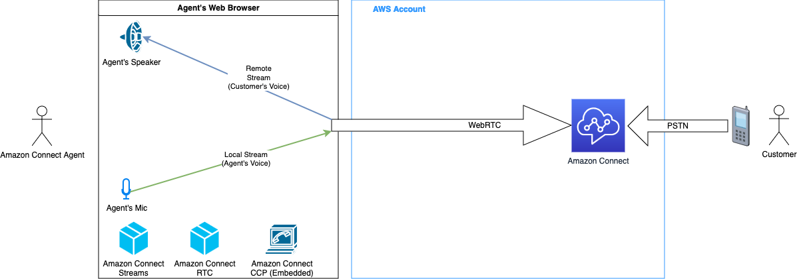
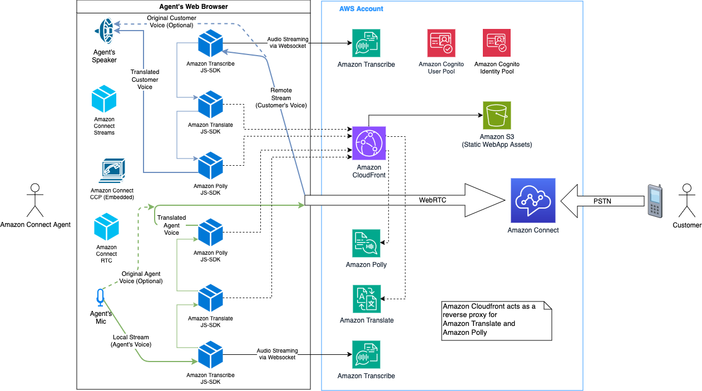

# Amazon Connect Voice to Voice (V2V) Translation

**BE AWARE:** This code base is a sample project designed to provide a demonstration and a base to start from for specific use cases. It's intent is to enable users to define the appropriate customer experience relevant to their business requirements and customer base by providing options to turn on and off specific experiences or adjust volumes independently. It should not be considered Production-ready.

## Use-case scenario

Businesses today face the challenge of providing effective customer support to a diverse global customer base with varying language preferences. Traditional approaches, such as text-based support, third party translation services, and multilingual contact centre agents, often result in suboptimal, inconsistent customer experiences and increased operational costs.

Amazon Connect is an AI-powered application that provides one seamless experience for your contact center customers and users. Customers can leverage the extensibility of Amazon Connect APIs to integrate with other AWS services, such as Amazon Translate, to enable an optimized agent and unified customer experience across text based communications, such as chat and SMS, with easy extensibility to the email channel. The final frontier in true omni-channel translation capabilities has been voice.

The Voice to Voice translation sample project leverages advanced speech recognition and machine translation technologies to enable near real-time translation of voice conversations between agents and customers. By using this sample project as a starter, businesses can develop an Amazon Connect powered solution allowing agents to communicate with customers in their preferred languages without the need for language proficiency or additional staffing.

## Here's a high-level overview of how the solution works:

1. Speech Recognition: The customer's spoken language is captured and converted into text using speech recognition technology. This text is then fed into the machine translation engine.
2. Machine Translation: The machine translation engine translates the customer's text into the agent's preferred language in near real-time. The translated text is then converted back into speech using text-to-speech synthesis.
3. Bidirectional Translation: The process is reversed for the agent's response, translating their speech into the customer's language and delivering the translated audio to the customer.
4. Seamless Integration: The Voice to Voice translation sample project integrates with Amazon Connect, enabling agents to handle customer interactions in multiple languages without any additional effort or training, using the below libraries:
   - [**Amazon Connect Streams JS**](https://github.com/amazon-connect/amazon-connect-streams):
     - Integrate your existing web applications with Amazon Connect
     - Embed Contact Control Panel (CCP) into a web page
     - Use the default built-in interface, or build your own from scratch
   - [**Amazon Connect RTC JS**](https://github.com/aws/connect-rtc-js):
     - Provides softphone support to Amazon Connect
     - Implements Amazon Connect WebRTC protocol and integrates with browser WebRTC APIs
     - Simple contact session interface which can be integrated with Amazon Connect Streams JS
     - In a typical Amazon Connect Streams JS integration, Amazon Connect RTC JS is not required
     - In this sample project, Amazon Connect RTC JS provides access to Amazon Connect WebRTC Media Streams
   - These 2 libraries are imported into Demo Webapp, without any modifications/customisations.

### Key limitations

- This is a sample project and it's not meant to be used in production environment(s)
- Webapp Authentication is implemented via simple redirect to Amazon Cognito Managed Login Page(s)
- For demo purposes, SSO/SAML federation with Amazon Cognito is not supported
- For demo purposes, Amazon Cognito and Amazon Connect are not integrated
- For demo purposes, Amazon Cognito User Pool and Identity Pool credentials are stored in browser's local storage (can be vulnerable to cross-site scripting (XSS) attacks)
- Both Agent Audio and Customer Audio are transcribed locally (agent's browser opening 2 websocket connections to Amazon Transcribe), therefore agent PC performance and network bandwidth need to be checked
- The demo Webapp provides a full control on Voice to Voice setup (i.e. selecting From and To languages, Amazon Polly voices, etc). These parameters would normally be set based on Amazon Connect Contact Attributes
- The sample project has not been tested with outbound calls, conference or transfers
- The sample project has not been tested in combination with other channels, such as chat, tasks, email
- When configuring regions for Amazon Transcribe/Translate/Polly, select a region that is closer to your agents (Amazon Connect instance can be in a different region)

## Solution architecture:

### Typical Amazon Connect CCP embedded to a custom webapp

### Amazon Connect Voice 2 Voice architecture:

## Solution setup

For detailed deployment instructions, solution components, and configuration details, please refer to the [Setup Guide](SETUP.md).

## Demo UI Guide

For detailed instructions on navigating the demo web application, configuring transcription/translation settings, and understanding the user interface, please refer to the [Demo Guide](DEMO.md).

## Security

See [CONTRIBUTING](CONTRIBUTING.md#security-issue-notifications) for more information.

## License

This library is licensed under the MIT-0 License. See the LICENSE file.
